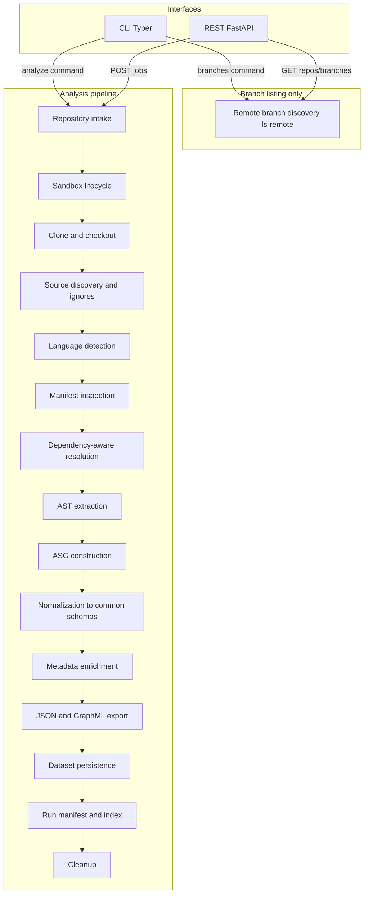
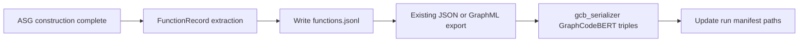

# Multi-language repository analysis system (backend-only)

## 1. Language recommendation and justification

**Choice: Python 3.12+** as the primary implementation language.

| Criterion                           | Why Python fits                                                                                                                                                                                                                                                               |
| ----------------------------------- | ----------------------------------------------------------------------------------------------------------------------------------------------------------------------------------------------------------------------------------------------------------------------------- |
| **Multi-language parsing maturity** | [tree-sitter](https://tree-sitter.github.io/tree-sitter/) has first-class Python bindings and maintained grammars for Python, TypeScript/JavaScript, Go, Java, C/C++, C#, Rust, and more. One orchestration layer can drive many grammars without shipping multiple runtimes. |
| **Static analysis / graph tooling** | Ecosystem for graph serialization (`networkx` optional), robust HTTP/CLI frameworks, subprocess integration for future LSP/compiler-backed backends.                                                                                                                          |
| **Backend maintainability**         | Clear module boundaries, rapid iteration, widespread hiring/debugging familiarity.                                                                                                                                                                                            |
| **Performance**                     | Analysis is dominated by parsing and I/O; Python + native tree-sitter core is sufficient for large repos. Hot paths can move to Rust extensions later without changing external contracts.                                                                                    |
| **CLI + REST**                      | [Typer](https://typer.tiangolo.com/) or Click for CLI; [FastAPI](https://fastapi.tiangolo.com/) for async REST, OpenAPI, and background jobs.                                                                                                                                 |
| **Testing**                         | `pytest`, fixtures for tiny synthetic repos, contract tests on JSON schemas.                                                                                                                                                                                                  |
| **Export**                          | Native `json`, stdlib or `lxml`/`xml.etree` for GraphML; Pydantic for schema validation.                                                                                                                                                                                      |

**Alternatives considered**

- **Rust**: Best raw performance and native tree-sitter; higher integration cost for JVM/.NET tooling and slower iteration for a research-heavy graph layer.
- **TypeScript/Node**: Strong tree-sitter story; weaker uniform story for non-JS languages’ auxiliary tooling in one process.
- **Go/Java**: Viable for services; multi-language parser orchestration is less consolidated than Python + tree-sitter for this scope.

**Parsing / analysis stack (pluggable)**

- **Default AST source**: tree-sitter per supported language (no fake trees—if a file fails to parse, record a warning and skip or attach error nodes).
- **ASG construction**: deterministic passes over tree-sitter captures + path/manifest-aware resolution (no `npm install` / `cargo build` unless explicitly added later as an optional extension).
- **Future backends** (interface only in v1): subprocess to language servers, Roslyn, javac-based tools—swappable behind a `ParserBackend` / `SemanticBackend` protocol.

---

## 2. System architecture



**Additive pipeline (FunctionRecord + GraphCodeBERT export)** — runs **after** ASG construction; does **not** replace or alter AST/ASG schemas.



**Branch discovery vs analysis (reconciled)**

- **`branches` CLI / `GET /repos/branches`**: only this path runs **remote branch discovery** (`git ls-remote` or equivalent). No sandbox clone required for listing (read-only remote query).
- **`analyze` / `POST /jobs`**: requires an explicit **`branch` or `commit` ref** (no implicit `ls-remote`). Pipeline steps are **sandbox → clone/checkout of that ref → …**; **remote branch listing is not part of the analyze hot path**. If the caller omits branch/commit, return a validation error pointing them at the branches endpoint.

**Concurrency model**

- CLI: synchronous pipeline or optional `asyncio` where it helps (subprocess/git).
- REST: FastAPI `BackgroundTasks` or in-memory job queue for MVP; see **Job state and process restarts** below. Scale-out = Redis/DB in a future phase.

**Job state and process restarts (in-memory store semantics)**

- **Volatile (lost on API restart):** in-memory records for jobs in `queued` or `running` state; any in-flight job is **not** recoverable—on startup, either omit those ids or document them as **failed** with reason `server_restart` if a persistent lease file is not implemented in v1.
- **Durable (survives restart):** everything written under **`dataset/`**: per-run artifacts, **`metadata/run_manifest.json`** (includes `run_id` / job correlation), and **`dataset/index.json`** (append-only listing of completed runs with paths). Implementations **must** append to the index **atomically** when a run completes successfully.
- **After restart:** `GET /datasets` and **`GET /jobs/{id}/result`** for **completed** runs **must** resolve from disk: **`job_id` should equal `run_id`** (UUID) recorded in `run_manifest.json` and the dataset index, so results are loadable without RAM. `GET /jobs/{id}` for unknown ids returns **404** (unknown) vs **410** (expired volatile) — pick **404** for simplicity unless id is in index.
- **Optional v1+ hardening (spec, not required for first commit):** write a small `dataset/jobs/{job_id}.json` pointer file at job completion mirroring paths—only if needed for audit; otherwise **index + run_manifest** suffice.

**Sandbox contract**

- Each run: `tempfile.TemporaryDirectory` or configurable root + UUID subdirectory under the **host** machine (never inside `dataset/`).
- Clone target **only** inside that directory; all artifacts copied to `{tool_repo}/dataset/...` before deletion.
- On success or failure: best-effort `shutil.rmtree` of sandbox (log failures).

**Path to tool repo**

- Resolve `DATASET_ROOT` to the directory containing this tool’s `pyproject.toml` (or env `ANALYSIS_TOOL_ROOT`), so outputs always land in **[this repository’s `dataset/`](dataset/)**, not in the clone.

---

## 3. Folder structure (proposed)

```text
src/repo_analysis/           # or shorter package name, e.g. depmap
  __init__.py
  config.py                  # settings, ignore defaults, paths
  log.py                     # app logging setup (not `logging.py` — avoids shadowing stdlib)
  cli/
    __init__.py
    main.py                  # Typer app: branches, analyze, validate, datasets, gcb-export
  api/
    __init__.py
    app.py                   # FastAPI factory
    routes/
      repos.py               # branch listing
      jobs.py                # start/status/results
      datasets.py            # list metadata
    deps.py                  # shared deps (settings, optional queue)
  intake/
    git_remote.py            # ls-remote, branch list
    clone.py                 # shallow clone, checkout
  sandbox/
    manager.py               # create/destroy sandbox
  discovery/
    walk.py                  # file walk + gitignore-style rules
    language_detect.py       # extension + content heuristics
  manifests/
    models.py                # normalized lock/manifest records
    readers/                 # package.json, go.mod, Cargo.toml, etc.
  resolution/
    graph.py                 # dependency graph from manifests
    workspace.py             # workspace/package roots
  parsing/
    backends/
      base.py                # protocols
      tree_sitter_backend.py
    registry.py              # language -> grammar, queries
  graph_build/
    ast_builder.py           # file + repo AST
    asg_builder.py           # semantic edges
    combine.py               # merge graphs with stable IDs
  extraction/
    __init__.py
    function_extractor.py    # tree-sitter walk -> FunctionRecord per func/method
    dfg.py                     # body subtree -> list[DFGEdge]; testable in isolation
  export/
    json_export.py
    graphml_export.py
    gcb_serializer.py        # GraphCodeBERT-style triples JSON Lines
    schema_version.py
  models/                    # Pydantic schemas (see below)
    ast.py
    asg.py
    function_record.py       # FunctionRecord (additive; does not change ast.py/asg.py)
    manifest_run.py
    warnings.py
  persistence/
    layout.py                # dataset path layout
    writer.py                # atomic writes, run folder creation
    index.py                 # dataset index append/update
  jobs/
    runner.py                # single orchestration entry for CLI + API
tests/
  extraction/
    test_dfg.py
    test_function_extractor.py
  export/
    test_gcb_serializer.py
  ...
dataset/                     # gitignored or partially tracked; README only optional
  .gitkeep
  index.json                 # append-only dataset index (survives API restarts)
```

**Dataset run layout (aligned with persistence):** each analysis run writes:

```text
dataset/<repo_slug>/<branch_slug>/<commit>_<timestamp>/
  ast/
    per-file/*.json
    combined.json
    combined.graphml
  asg/
    per-file/*.json
    combined.json
    combined.graphml
  metadata/
    run_manifest.json
    repo_summary.json
    language_summary.json
    warnings.json
    config_snapshot.json
    optional: json_schema/   # exported schemas for consumers
  functions.jsonl            # one FunctionRecord JSON per line (repo root of run folder)
  gcb_triples.jsonl          # GraphCodeBERT-style triples (see §11)
```

---

## 4. Core data schemas (Pydantic + version field)

**Stable node IDs (decision for v1)**

- **AST node `id`:** `ast:{commit_sha}:{posix_relative_path}:{start_byte}:{end_byte}:{grammar_node_type}`
  - **Rationale:** Deterministic for a given snapshot (commit + file bytes + tree-sitter grammar node type). Reproducible across runs on identical trees without relying on traversal order or unstable runtime pointers.
  - **Collision handling:** If two distinct nodes share the same `(path, start_byte, end_byte, type)` (rare), append `:n` with a monotonic `n` starting at `0` in deterministic sibling order.
  - **Explicit non-goal:** IDs are **not** stable across arbitrary reformats of the same logical code (whitespace/comment edits change byte spans). Incremental re-analysis and format-invariant IDs are **out of scope for v1**; a future mode could adopt content-hash or Merkle schemes at the cost of complexity.
- **ASG node `id`:** `asg:{commit_sha}:{posix_relative_path}:{asg_kind}:{ordinal}` where `ordinal` is a **per-file, per-kind** counter assigned in lexicographic sort order of a deterministic tie-breaker (e.g. span, then label). ASG nodes may also reference originating AST node ids in a dedicated field (`source_ast_node_ids[]`) without merging ID namespaces.

**Shared metadata** (embedded in every artifact and in per-file envelopes):

- `repository_name`, `repository_url`, `branch`, `commit_sha`, `analysis_timestamp` (ISO 8601 UTC)
- `source_language`, `relative_path` (for per-file; null for combined)
- `parser_id` (e.g. `tree-sitter-python@0.21`), `generation_version` (tool semver)
- `dependency_resolution_status`: see **enum semantics (default: no registry network)** below
- `warnings[]`: structured `{ code, message, path?, line? }`
- `errors[]` (optional): same shape for hard failures on a file

**`dependency_resolution_status` semantics (no registry / no `npm install` default)**

| Value             | Meaning                                                                                                                                                                                                                                                                                                                      |
| ----------------- | ---------------------------------------------------------------------------------------------------------------------------------------------------------------------------------------------------------------------------------------------------------------------------------------------------------------------------- |
| **manifest_only** | Manifests and lockfiles were read and normalized into a **static** dependency graph; **no** registry or network resolution was attempted. This is the **typical** successful baseline for v1.                                                                                                                                |
| **full**          | Within-repo and manifest/lockfile-static resolution **succeeded for every edge the tool attempts** in the current policy (e.g. all intra-repo imports mapped, lockfile entries matched to workspace packages where applicable). Still **does not** imply npm/PyPI/crates.io resolution—only **offline/static** completeness. |
| **partial**       | Mixed outcome: some edges unresolved, ambiguous package roots, missing lockfile, or parser failures on a subset of manifests.                                                                                                                                                                                                |
| **unresolved**    | Insufficient manifest data (or unparseable) to build a meaningful graph for major ecosystems detected.                                                                                                                                                                                                                       |

Registry-backed or install-based resolution remains an **optional future extension**; if added, extend the enum or add `resolution_mode: static | registry` to avoid overloading **full**.

**AST**

- **Nodes**: `id`, `kind` (tree-sitter type or normalized), `label`, `span` (start/end byte/line/col), optional `text_digest`, `children_ids`
- **Edges**: `id`, `type` (`child | next_token | ...`), `source_id`, `target_id`, optional `role`

**ASG (single cross-language schema)**

- **Modeling approach:** One **`AsgNode`** and one **`AsgEdge`** Pydantic model for **all** languages, with a **required string discriminator** `kind` (e.g. `symbol_def`, `symbol_ref`, `module`, `package`, `import`, `type`, `call`, `inheritance`, `impl`, `variable_binding`). Optional fields are grouped in a **`payload: dict[str, JSONValue]`** (or a small set of typed sub-models keyed by `kind`) so that `SymbolDef` vs `Package` do not require separate top-level classes that drift across modules—**implementers use the same envelope everywhere**.
- **Topology vs semantics:** Edge types express relationships (`defines`, `calls`, …); node `kind` expresses role. **Do not** subclass graph topology differently per language at the serialization boundary.
- **Language-specific attributes:** Only inside **`payload`** (namespaced keys e.g. `python.decorators`) or `warnings`—never as parallel ad-hoc top-level fields per language.
- **Edges**: `type` (`defines`, `references`, `imports`, `calls`, `subtypes`, `implements`, `uses_type`, `depends_on`, `cross_file_ref`), `source_id`, `target_id`, optional `confidence` / `resolution`

**Cross-language semantic edges (e.g. Python invoking a Go binary, TS wrapping Rust WASM)**

- **Out of scope for v1.** The ASG is **per repository snapshot** and **per process**; linking across language runtimes without explicit FFI/bindgen metadata is ambiguous. Document as future work (optional manifest hints, `cffi`, `wasm-bindgen`).

**Run manifest** (JSON in `metadata/run_manifest.json`)

- Run id (**must equal `job_id` for REST**), input URL, branch, commit, timing, file counts per language, list of output paths, tool version, git clean/dirty note of tool repo (optional), `dependency_resolution_status` rollup
- **Additive fields/paths (FunctionRecord + GCB):** paths to **`functions.jsonl`** and **`gcb_triples.jsonl`** at the run folder root (or explicit keys `artifacts.functions_jsonl`, `artifacts.gcb_triples_jsonl`) so consumers and `gcb-export` can locate inputs/outputs

**Dataset index** (e.g. `dataset/index.json` or line-delimited JSON)

- Append-only entries: `{ run_id, repo, branch, commit, timestamp, path }` for API listing

Schemas enforced at write time; optional JSON Schema export under `metadata/` for consumers.

**GraphML export contract (deterministic, consumer-safe)**

- **One graph per file** (`combined.graphml`): single `<graph>` with `edgedefault` directed; exporter sorts nodes by `id` string and edges by `(source, target, edge_kind)` before writing.
- **`<key>` ids (node data):** `node_id` (string, equals GraphML `node.id`), `kind`, `language`, `source_path` (POSIX, relative to repo root; empty for synthetic repo-level nodes), `label`, `commit_sha`, `tool_version`, `ext_json` (optional stringified JSON for extensions).
- **`<key>` ids (edge data):** `edge_kind` (relationship type), `confidence` (optional; float 0–1, or sentinel `-1` / omit if N/A), `ext_json` (optional).
- **Language-specific / extensibility:** anything beyond the common keys lives in **`ext_json`** with **namespaced** inner keys (`python.decorators`, `csharp.attributes`). Do not emit unbounded dynamic XML attributes per node—preserves deterministic schema and diffing.
- **AST vs ASG files:** reuse the same `<key>` set; set graph-level data `graph_kind` = `ast` | `asg` on the root `<graph>` (redundant with filename for tooling).

---

## 5. CLI design

**Entry**: `python -m repo_analysis` or console script `repo-analyze`.

| Command                                                                     | Behavior                                                                                                                                                                                                                         |
| --------------------------------------------------------------------------- | -------------------------------------------------------------------------------------------------------------------------------------------------------------------------------------------------------------------------------- |
| `branches <url>`                                                            | Fetch remote refs (public only); print branch names (machine-readable `--json`).                                                                                                                                                 |
| `analyze --url URL --branch BRANCH [--output-root dataset] [--config file]` | Full pipeline; writes under `dataset/<repo>/<branch>/<commit>_<timestamp>/`.                                                                                                                                                     |
| `validate <run_dir>`                                                        | Validate JSON shapes, required metadata fields, GraphML well-formedness.                                                                                                                                                         |
| `datasets list`                                                             | Print known runs from index (JSON).                                                                                                                                                                                              |
| `gcb-export <run_dir>`                                                      | Re-run **only** `export/gcb_serializer.py` on a **completed** run (reads `functions.jsonl` or equivalent inputs under `run_dir`, writes/refreshes `gcb_triples.jsonl`); for changed serialization options without full re-parse. |

Global flags: `--verbose`, `--dry-run` (optional: plan only), config for ignore rules.

---

## 6. REST API design (FastAPI, backend-only)

Base path e.g. `/api/v1`.

| Method | Path                   | Purpose                                                                |
| ------ | ---------------------- | ---------------------------------------------------------------------- |
| GET    | `/repos/branches?url=` | List branches (calls same logic as CLI).                               |
| POST   | `/jobs`                | Body: `{ url, branch }`; returns `{ job_id }`.                         |
| GET    | `/jobs/{id}`           | Status: `queued \| running \| completed \| failed` + progress message. |
| GET    | `/jobs/{id}/result`    | Run manifest + paths to artifacts (not necessarily file bodies).       |
| GET    | `/datasets`            | List runs from index (pagination query params).                        |

**Auth**: none for v1 (internal/trusted network); document as future work.

**CORS**: disabled or minimal (no browser client assumed).

---

## 7. Implementation plan (phased)

**Phase A – Skeleton**

- `pyproject.toml` with Ruff, mypy (strict where practical), pytest, FastAPI, Typer, Pydantic v2, tree-sitter + pinned grammar packages or build grammars as git submodules / CI artifact (document choice).
- Config loading (env + optional YAML), default ignore globs matching user list.
- Sandbox + clone + `git rev-parse HEAD` for commit SHA.

**Phase B – Discovery and manifests**

- File walker respecting `.gitignore` + extra configurable ignores.
- Manifest readers: normalize name → version constraints where parseable; build a **static manifest/lockfile graph** only. Set `dependency_resolution_status` per the enum: default success path is **`manifest_only`**; promote to **`full`** / **`partial`** / **`unresolved`** using offline rules in §4—never imply registry resolution.

**Phase C – Parsing**

- Register tree-sitter languages; per-file parse → canonical AST node/edge model using **AST ID scheme in §4** (commit + path + span + type + collision suffix).
- Combined repo AST: union of all files with those IDs; verify no duplicate ids after merge.

**Phase D – ASG**

- Per-language query modules (tree-sitter queries) for defs/refs/imports/calls where grammar supports it.
- Cross-file linking using relative paths + manifest workspace roots; mark `dependency_resolution_status` and warnings when ambiguous.

**Phase E – Export**

- JSON writers with sorted keys for determinism where applicable.
- GraphML: implement **GraphML export contract** above; validate XML; snapshot tests on golden small graphs.

**Phase F – Persistence**

- Layout under [dataset/](dataset/) as specified; `metadata/config_snapshot.json` copies effective config; `warnings.json` aggregates all warnings.

**Phase G – API + CLI**

- Wire `jobs.runner` to both; in-memory job store with thread/async lock; **generate `run_id` at job creation and use it as `job_id`** so completed runs resolve from `dataset/` after restart per §2.

**Phase H – Quality**

- Unit tests for manifest parsers, path normalization, ignore rules, ID stability.
- Integration test: tiny fixture repo in `tests/fixtures/` run through full pipeline (no network in CI, or optional network-marked test).

**Phase I – FunctionRecord extraction and GraphCodeBERT serialization (additive)**

- Implement **`models/function_record.py`** (`FunctionRecord` Pydantic model; does **not** modify existing `ast.py` / `asg.py` models).
- Implement **`extraction/dfg.py`** and **`extraction/function_extractor.py`** (tree-sitter only unless a dependency is unavoidable—document in `pyproject.toml` with comment).
- Wire **`jobs/runner.py`:** after ASG construction, run function extraction across parsed files → **`functions.jsonl`**; after existing export phase, run **`gcb_serializer`** → **`gcb_triples.jsonl`**; append both paths to **run manifest**.
- CLI: **`gcb-export <run_dir>`** as specified in §5.
- Tests: per §8 and §11.

---

## 8. Tests

- **Unit**: ignore matching, manifest parsing (sample snippets), graph merge, metadata validation.
- **Integration**: end-to-end on bundled zip/tiny git fixture without external clone.
- **Contract**: JSON artifacts validate against Pydantic models; GraphML parses.
- **Optional**: `--network` marked test cloning a tiny public repo (CI nightly).
- **`tests/extraction/test_dfg.py`**: unit tests for **`dfg.py`** on small synthetic **Python** and **JavaScript** function snippets (no network, no clone).
- **`tests/extraction/test_function_extractor.py`**: docstring vs body token separation, comment extraction, type annotation capture, **stable `FunctionRecord.id`** across two runs of the same file.
- **`tests/export/test_gcb_serializer.py`**: **512-token budget** truncation sets `truncated: true`, empty docstring → empty `nl_tokens`, output is valid **JSON Lines**.

---

## 9. Run instructions (to ship in README when implementing)

- Create venv, `pip install -e ".[dev]"`.
- `repo-analyze branches https://github.com/...`
- `repo-analyze analyze --url ... --branch main`
- `repo-analyze gcb-export <run_dir>` to refresh GraphCodeBERT triples without re-parsing (after implementation).
- `uvicorn repo_analysis.api.app:app --reload` for API.
- Set `ANALYSIS_TOOL_ROOT` if cwd is not the tool repo.

---

## 10. Future extensibility

- Optional subprocess backends: `rust-analyzer`, `pylsp`, OmniSharp for richer ASG when tree-sitter alone is thin.
- Optional dependency installation in isolated containers (opt-in flag).
- Pluggable storage for jobs (Redis/Postgres).
- WASM / sandboxed execution for untrusted URL handling.

---

## Quality bar (explicit)

- No placeholder parsers: failed parses → warnings + partial graphs, not fabricated nodes.
- Every artifact carries required metadata fields listed above.
- Language support table in docs: per-language **AST completeness** vs **ASG depth** (e.g. calls/imports first; full type inference out of scope unless backend added).

---

## 11. FunctionRecord extraction layer and GraphCodeBERT serialization (additive)

This section **extends** the system without changing existing **AST** or **ASG** schemas or export formats. All artifacts below are **additional** outputs.

### 11.1 Pydantic model: `FunctionRecord`

**Location:** [`src/repo_analysis/models/function_record.py`](src/repo_analysis/models/function_record.py) (new file).

| Field              | Type          | Notes                                                                                                                                                                                                                                  |
| ------------------ | ------------- | -------------------------------------------------------------------------------------------------------------------------------------------------------------------------------------------------------------------------------------- |
| `id`               | `str`         | Stable string: `repo:path:class_name?:func_name:overload_index` (omit `class_name?` segment for module-level functions—use empty or sentinel as defined in implementation docs; **must** be deterministic for the same repo snapshot). |
| `signature_tokens` | `list[str]`   |                                                                                                                                                                                                                                        |
| `body_tokens`      | `list[str]`   | Docstrings and comments **must not** be embedded here.                                                                                                                                                                                 |
| `docstring`        | `str \| None` |                                                                                                                                                                                                                                        |
| `comments`         | `list[dict]`  | Each `{ "line": int, "text": str }`.                                                                                                                                                                                                   |
| `span`             | nested dict   | `{ "start": { "line", "col" }, "end": { "line", "col" } }` — prefer typed Pydantic sub-models for mypy.                                                                                                                                |
| `parent_class`     | `str \| None` |                                                                                                                                                                                                                                        |
| `module_path`      | `str`         |                                                                                                                                                                                                                                        |
| `language`         | `str`         |                                                                                                                                                                                                                                        |
| `dfg_edges`        | `list[dict]`  | Each `{ "var_name": str, "def_node_id": str, "use_node_id": str }`.                                                                                                                                                                    |
| `call_edges`       | `list[dict]`  | Each `{ "callee_id": str, "resolved": bool }` — set **`resolved: False`** when callee cannot be matched to a known **`FunctionRecord.id`** in the current repo index.                                                                  |
| `type_annotations` | `list[dict]`  | Each `{ "node_id": str, "annotation_text": str }`.                                                                                                                                                                                     |

Use **Pydantic v2** field validators where needed; keep models **strict**-friendly for mypy.

### 11.2 Module: [`src/repo_analysis/extraction/`](src/repo_analysis/extraction/)

**`function_extractor.py`**

- Walks the **tree-sitter** AST for supported languages (start with languages required by tests: Python, JavaScript; extend per existing parser registry).
- Emits **`FunctionRecord`** instances for each function and method.
- **Docstrings** and **inline comments** go to `docstring` / `comments` only—not into `signature_tokens` / `body_tokens`.
- **Type annotations** where present → `type_annotations` (with `node_id` referencing tree-sitter node identity consistent with extractor’s internal scheme—document alongside `def_node_id` / `use_node_id` in DFG).
- **Call edges:** populate `callee_id` from static name resolution where possible; **`resolved: False`** if no matching `FunctionRecord.id` in the repo-wide set built during the extraction pass.
- **DFG:** delegate body-level def→use analysis to **`dfg.py`** (see below).

**`dfg.py`**

- **Isolated** API: given a **function body** `tree_sitter` subtree (and minimal context), returns `list[DFGEdge]` (typed as Pydantic models or `TypedDict` + cast, per project style) suitable for assigning to `FunctionRecord.dfg_edges`.
- Implements a **lightweight** variable-level def→use walk using tree-sitter **node types** and scopes—**no language server**.
- Unit-tested independently of the full extractor (**§8, §11.6**).

### 11.3 Module: [`src/repo_analysis/export/gcb_serializer.py`](src/repo_analysis/export/gcb_serializer.py)

- **Purpose:** Emit **GraphCodeBERT-compatible** training triples `(code_tokens, nl_tokens, dfg_edges)`.
- **`nl_tokens`:** from **`FunctionRecord.docstring`** tokenized/split per project convention if present; otherwise **empty list**.
- **`code_tokens`:** derived from function text per serializer policy (typically **`signature_tokens` + `body_tokens`**, or a documented join)—document the exact rule in code docstring.
- **Output path:** one **JSON Lines** file per run: `dataset/<repo>/<branch>/<run>/gcb_triples.jsonl` (same run root as `functions.jsonl`).
- **Line format:** each line is a JSON object, e.g. `{ "id": "...", "code_tokens": [...], "nl_tokens": [...], "dfg": [ { "var": ..., "def": ..., "use": ... } ] }` (field names **`var` / `def` / `use`** as specified; **`def`** is a key name—ensure JSON serialization handles that it is not Python’s `def` keyword).
- **512 token budget:** if `len(code_tokens) + len(nl_tokens) > 512`, **truncate `body_tokens` from the end** (after reconstructing code token list if needed) and set **`truncated: true`** on that record; if within budget, **`truncated: false`** or omit per schema consistency.

### 11.4 Pipeline wiring ([`jobs/runner.py`](src/repo_analysis/jobs/runner.py))

1. After **ASG construction** completes (existing step unchanged), run **FunctionRecord extraction** over all successfully parsed files in the run.
2. Write **`functions.jsonl`** at the run folder root: **one JSON-serialized `FunctionRecord` per line**.
3. Continue with existing **export** (JSON/GraphML) unchanged.
4. Invoke **`gcb_serializer`** to produce **`gcb_triples.jsonl`** in the same run directory.
5. Update **`metadata/run_manifest.json`** to include paths (or artifact keys) for **`functions.jsonl`** and **`gcb_triples.jsonl`**.

### 11.5 CLI

- Command: **`repo-analyze gcb-export <run_dir>`**.
- Behavior: load **`functions.jsonl`** from `<run_dir>` (or fail with a clear error if missing), re-run **only** `gcb_serializer` logic, write/update **`gcb_triples.jsonl`**, optionally refresh manifest entry for that artifact.

### 11.6 Tests (mandatory)

- **`tests/extraction/test_dfg.py`** — §8.
- **`tests/extraction/test_function_extractor.py`** — §8.
- **`tests/export/test_gcb_serializer.py`** — §8.

All new modules: **type annotations**, **`mypy --strict`** clean, match existing package style.

### 11.7 Dependencies

- **Default:** **tree-sitter only** for extraction and DFG.
- **New third-party packages:** **do not add** unless tree-sitter alone cannot implement a required behavior; if added, record in **[`pyproject.toml`](pyproject.toml)** with an **inline comment** explaining why (e.g. tokenizer for GCB tokenization if not using simple `str.split`).
